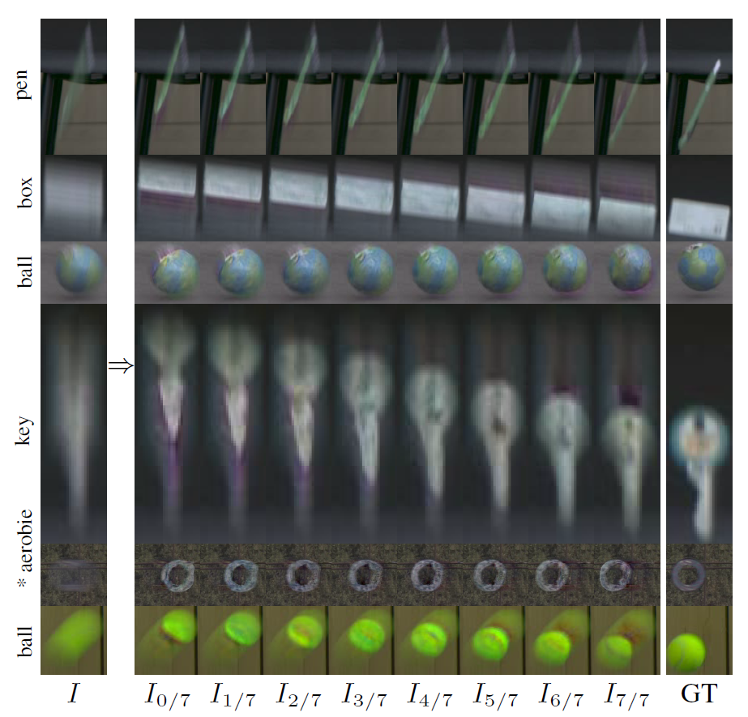

# Evaluation, Training, Demo, and Inference of SI-DDPM-FMO 

### Single-Image Deblurring, Trajectory and Shape Recovery of Fast Moving Objects with Denoising Diffusion Probabilistic Models (WACV 2024)
#### Radim Spetlik, Denys Rozumnyi, Jiri Matas




### Pre-trained models

The pre-trained SI-DDPM-FMO model as reported in the paper will be available shortly [here](https://drive.google.com/drive/folders/1sS67PAuaKzffSOw6h0pwhKE-Wsvz6nA8?usp=drive_link). 


### Synthetic dataset generation
For the dataset generation, please download: 

* [ShapeNetCore.v2 dataset](https://www.shapenet.org/).

* Textures from the [DTD dataset](https://www.robots.ox.ac.uk/~vgg/data/dtd/). The exact split used in DeFMO is from the "Neural Voxel Renderer: Learning an Accurate and Controllable Rendering Tool" model and can be downloaded [here](https://polybox.ethz.ch/index.php/s/9Abv3QRm0ZgPzhK).

* Backgrounds for the training dataset from the [VOT dataset](https://www.votchallenge.net/vot2018/dataset.html). 

* Backgrounds for the testing dataset from the [Sports1M dataset](https://cs.stanford.edu/people/karpathy/deepvideo/).

* Blender 2.79b with Python enabled.

Then, insert your paths in renderer/settings.py file. To generate the dataset, run in renderer sub-folder: 
```bash
python run_render.py
```
Note that the full training dataset with 50 object categories, 1000 objects per category, and 24 timestamps takes up to 1 TB of storage memory. Due to this and also the ShapeNet licence, we cannot make the pre-generated dataset public - please generate it by yourself using the steps above.

Reference
------------
If you use this repository, please cite the following [publication](https://arxiv.org/abs/2012.00595):

```bibtex
@inproceedings{siddpmfmo2024,
  author = {Radim Spetlik and Denys Rozumnyi and Jiri Matas},
  title = {Single-Image Deblurring, Trajectory and Shape Recovery of Fast Moving Objects with Denoising Diffusion Probabilistic Models},
  booktitle = {WACV},
  address = {Waikoloa, Hawaii, USA},
  month = jan,
  year = {2024}
}
```
